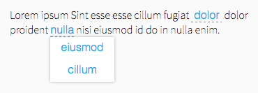

# Inline Form

This package contains an element, which can add a input or select into an inline text.



## Installation

    $ meteor add frozeman:inline-form

## Usage

To add a text input just add the following into an inline text:

```html
<p>Lorem ipsum Enim {{> inlineForm name="myInput" value="Some default text"}} irure qui tempor velit do Ut id elit cupidatat reprehenderit do labore dolor Ut enim in.</p>
```

Text inputs can get the following values:


- `name="myInput"` - The name of the input/select field
- `placeholder="Placeholder Text"` - Add a placeholder text, works only for the input
- `width="200px"` - set a fixed width (default is to autogrow)
- `disabled=true` - disables the input/select


To add a select simply use the `items` property and give it an array with `text` and `value` properties:

```json
[{
    text: 'Option 1',
    value: 'myValue1'
},{
    text: 'Option 2',
    value: 'myValue2'
}]
```

```html
<p>Lorem ipsum Enim {{> inlineForm name="myInput" items=myItems value="myValue2"}} irure qui tempor velit do Ut id elit cupidatat reprehenderit do labore dolor Ut enim in.</p>
```

If you give a value, it will pre-select the item, which matches the value.